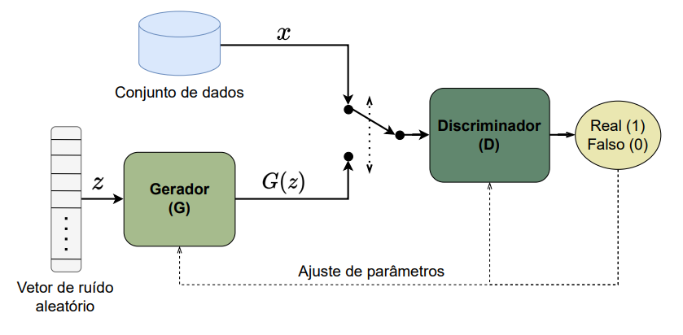

# FP-GAN
This is a Generative Adversarial Network-based Network Intrusion Detection System built for my college course Final Project.

The document describing this system (only in PT-BR) is available at its own [git repository](https://github.com/VitorgsRuffo/College-Final-Project).

